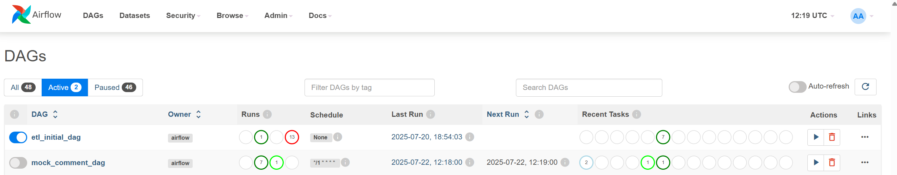
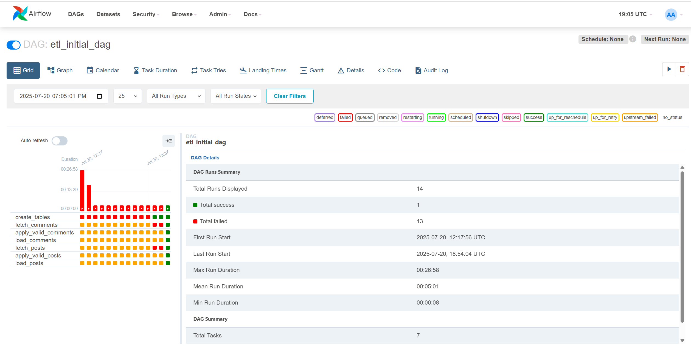
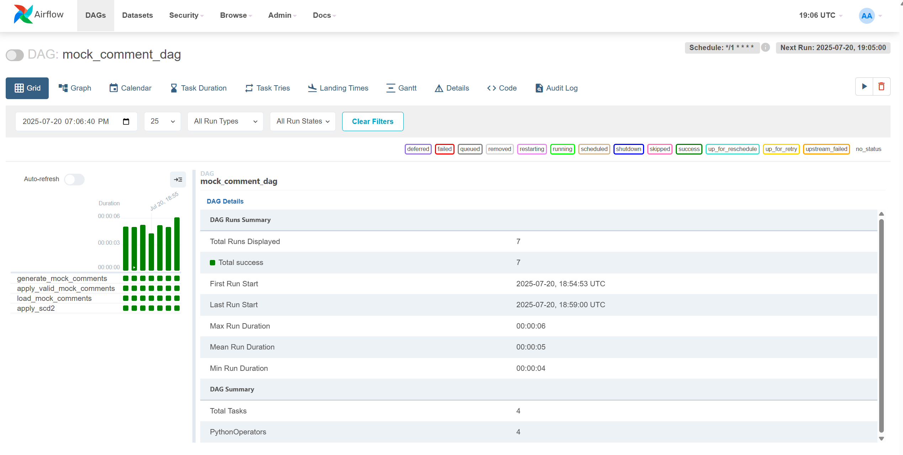
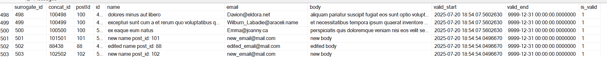
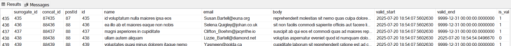

# data_pipelines_airflow
Data pipelines project which uses airflow as a scheduling tool. In this project, I get fake API data (from JSONPlaceholder), transform it, and insert it into prepared SQL tables. In the next steps, I create simulated new and edited data. I perform Slowly Changing Dimension (type 2) processing to keep data consistency.

I created two airflow DAGs. The first one is an 'initial run' that creates new tables in the local database. The second job simulates new and edited fake data. I schedule the second job to run every 1 minute, which simulates fetching online data from the API. The tables keep updating continuously as long as the Dagster server is running. 

---

## 📦 Dataset

Project based on the Fake API data from from https://jsonplaceholder.typicode.com/, which contains comments (https://jsonplaceholder.typicode.com/comments) and posts (https://jsonplaceholder.typicode.com/comments) data.

---

## 🔧 Project Overview

(data_loader_airflow.py):

Main Python module which contains the DataLoadManager class and SQL schema queries.

(airflow_func.py):

This file contains airflow functions like fetching data or applying the Slowly Changing Dimension model. It is based on the DataLoadManager class functions.

(etl_initial_run.py):

This file contains etl_inital_run DAG which creates tables and fetches comments and posts data

(mock_comment_dag.py):

This file contains mock_comment DAG which simulates mock data and inserts this data using the SCD2 model (every one minute)

Config filee is used to configure the Dagster pipelines.

Files docker-compose and dockerfile are used for airflow configuration with the docker container

---

Airflow:

In a Airflow GUI we can see two DAGs available. etl_initial_run should be running once at the start. Mock_comment_dag runs every minute ribbon if this DAG is active (fetching and inserting new simulated data):

For each DAG every run could be find with the success/error information:

etl_initial_run

mock_comments

Slowly Changing DImension 2 (SCD2) Data Model:

To implement SCD2, three columns are added to the SQL table: valid_start, valid_end, and is_valid. They store, respectively, the data fetch date, the end date of validity, and a flag that shows if the row is currently valid.

If there are new edited data, the old one are automatically treated as not valid (postId = 88, id = 438)

 

